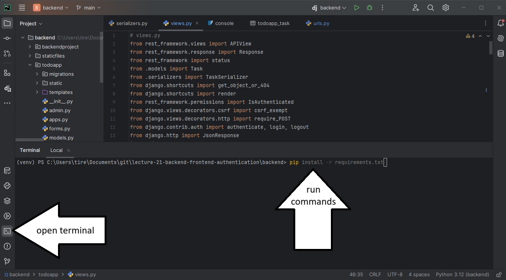
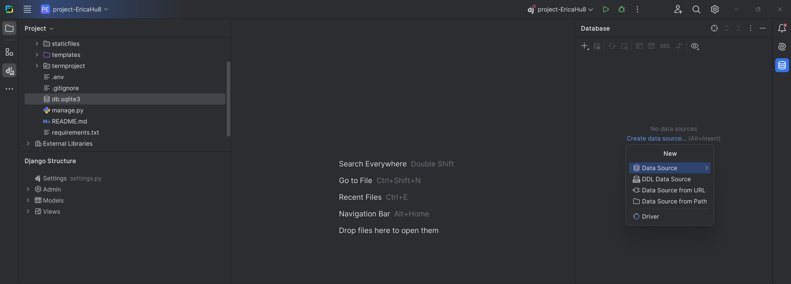
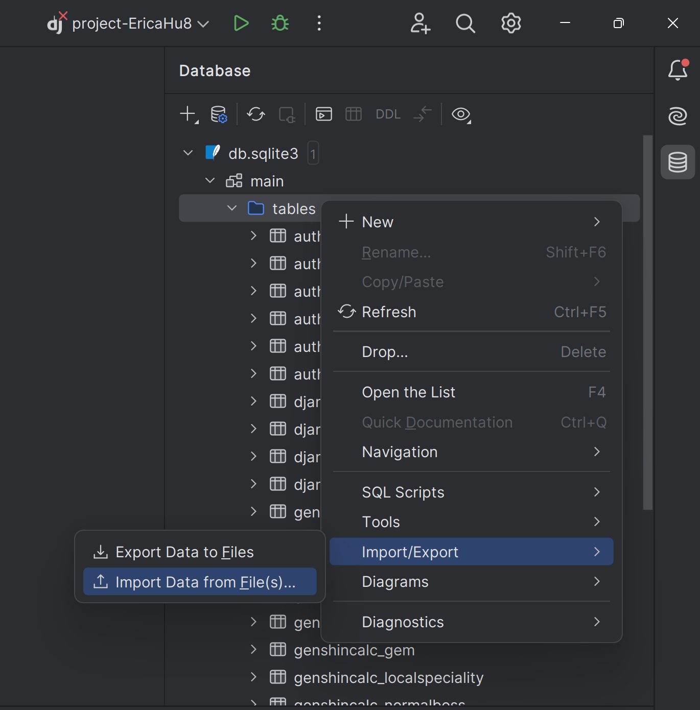
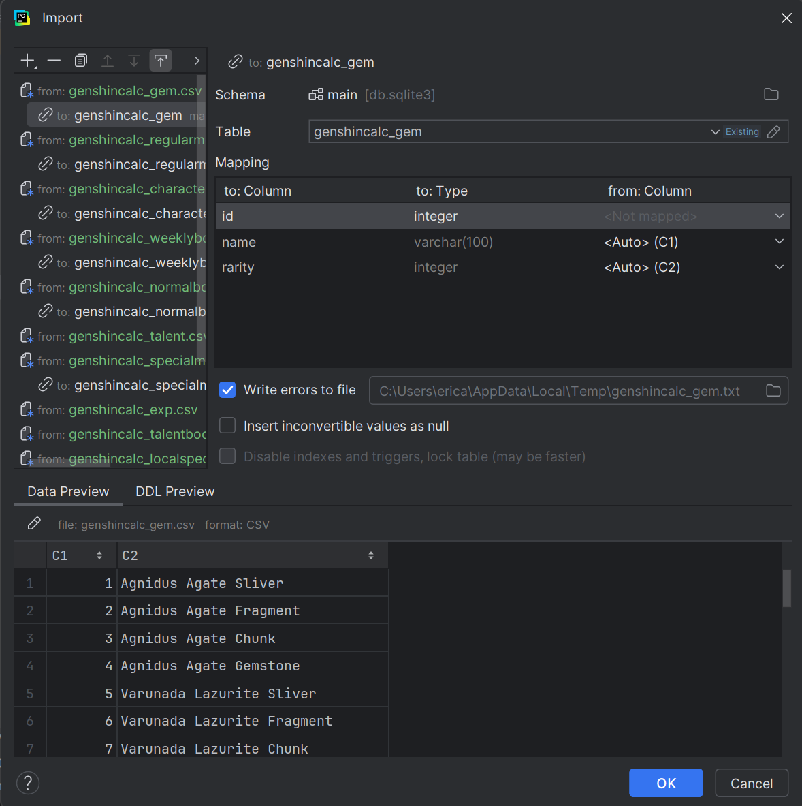

# Genshin Impact Character Calculator App
## created by Erica Hu (ID: 101270976)
genshincalc is a webapp designed to:
1) Let you choose a Genshin Impact character (with filters to help you find the character)
2) Let you choose leveling goals for the character's Level, Normal Attack, Skill, and/or Burst 
3) Show the total amount of materials needed to reach the previously inputted leveling goals

Some additional features include:
* Create user accounts to:
  * Store past calculation configurations for characters
  * See the 5 most recent calculations made on the homepage
  * Clear all past calculations made by the account
  * Upload a profile picture to the account that will be displayed

# How to set up Genshin Calculator
## Prerequisites

* Ensure Python is installed (at least Python 3.10): https://www.python.org/downloads/
* Ensure Pycharm is installed: https://www.jetbrains.com/pycharm/download/?section=windows

If you needed to install Python, you'll need to restart your computer before continuing.

## Steps to get this django application running on your own PC
1) Open a terminal and navigate to the folder you want to create your project in (e.g. `cd ~Documents/Code`)
2) Open Command Prompt and clone this repository with `git clone <link to this repository>`
2) Open PyCharm
5) Open the repository with PyCharm. You can do this by going file->open and selecting the cloned folder
*The cloned folder should be the very top of your project directory*
6) Open a terminal using PyCharm and install dependencies using `pip install -r requirements.txt`

7) Also in the terminal, run the following 2 commands:
   1) `pip install Pillow`
   2) `pip install django-filter`
8) Create a file called `.env` in the top level directory (should be in the same folder as manage.py)
9) Generate a secret key by running `python -c 'from django.core.management.utils import get_random_secret_key; print(get_random_secret_key())'` in the terminal. Copy the output.
10) Edit `.env` (created in part 8) and add a line that says `SECRET_KEY="your-secret-key-here"`. Paste the output from part 6 into 'your-secret-key-here'.
11) On the terminal, run `python manage.py migrate`, a new file called `db.sqlite3` should've been created after this.
12) Open the `Database` tab on the  right of the PyCharm interface and `Create data source from Path` and select the database file that was created in section 11 `db.sqlite3`

13) Expand db.sqlite3 until you see a list of tables, right-click on the tables directory and `Import Data from File(s)`

14) Select all the .cvs files found under `...\genshincalc\cvs_assets`
15) Adjust all the imports "to:" table names by removing the `_2` at the end of the generated table names. You confirm it was done properly when the "New" on the right of the table name changes to "Existing". Press `OK` to import the data

    1) If you can't see "to:" under certain imports, double-click on the "from:" path, and it will expand to show "to:"
16) Run the server by clicking the play button or running `python manage.py runserver` on the terminal 
17) Navigate to 127.0.0.1:8000! You should be able to see and run genshincalc now!

